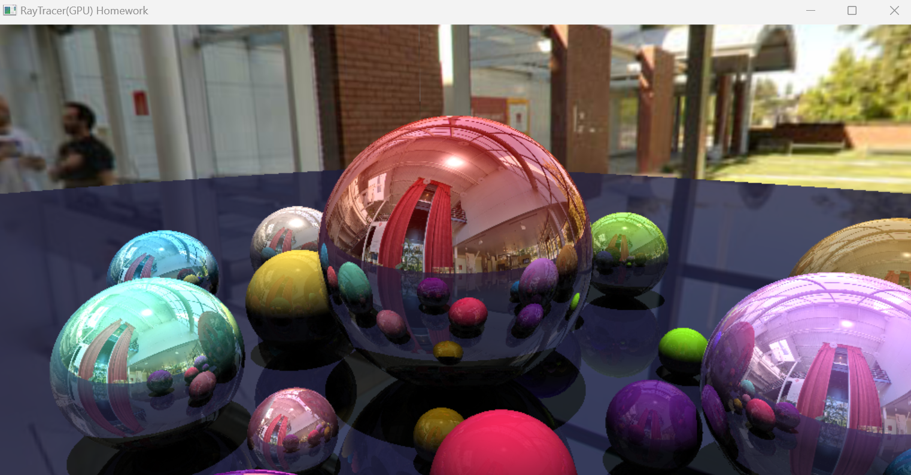

# GPU-based Ray Tracer (GLSL)

OpenGL + GLSL 기반 GPU Ray Tracer 구현 프로젝트입니다.  
학부 컴퓨터 그래픽스 수업 과제로 진행했으며, fragment shader에서 ray tracing 파이프라인을 직접 구현했습니다.

## 결과

멀티바운스 반사와 환경맵 텍스처가 적용된 구 렌더링 결과입니다.

## 구현 내용

- **Ray-Sphere Intersection** — 광선과 구의 교차 검출
- **Phong Shading** — Diffuse + Specular 조명 모델
- **Shadow Detection** — 구 아래 위치의 그림자 판별
- **Multi-bounce Reflection** — uBounceLimit 횟수만큼 반사광 추적
- **Environment Mapping** — Cubemap 텍스처를 활용한 환경 반사
- **Material-based Reflectance** — 물체별 k_s 값에 따른 반사율 차등 적용

## 기술 스택

- C++, OpenGL
- GLSL (Vertex / Fragment Shader)

## 참고

Ray-Sphere intersection 수식 구현 시 아래 레퍼런스를 참조했습니다.
- https://www.scratchapixel.com/lessons/3d-basic-rendering/minimal-ray-tracer-rendering-simple-shapes/ray-sphere-intersection
- https://github.com/zackthomas1/CS4600_IntroCompGraphics
